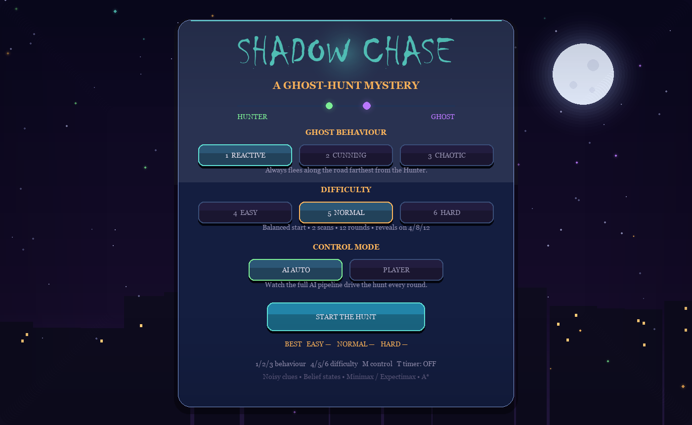
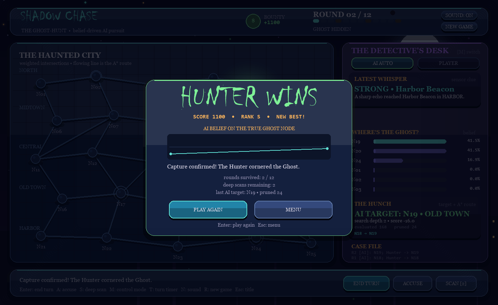
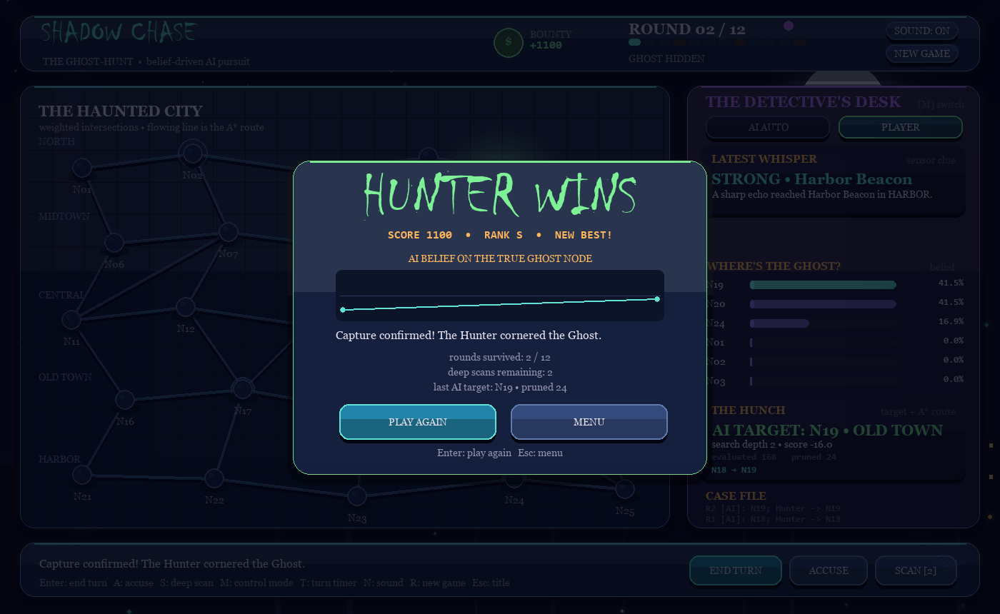

# Shadow Chase

   

**Shadow Chase** is a compact, demo-friendly Artificial Intelligence project built with Python and Pygame. A hidden Ghost moves through a neon city while the Hunter AI uses noisy sensor clues, a belief distribution, a shallow adversarial search, and A* pathfinding to investigate likely locations.

The project deliberately keeps the graph small (25 intersections) and each decision shallow so that every part of the AI can be explained clearly in a classroom demonstration.

| Title screen | The hunt in progress |
| --- | --- |
|  |  |

| Ghost sighting | End-of-game AI performance |
| --- | --- |
|  |  |

## Features

- 25-node fixed **weighted city graph** with named districts and sensor stations.
- **Randomised start positions** every game: the Hunter and Ghost spawn on different nodes each run, kept apart by the chosen difficulty.
- Hidden Ghost with three selectable behaviour policies (Reactive, Cunning, Chaotic).
- Three **difficulty levels** (Easy / Normal / Hard) controlling start distance, scan charges, round count, and reveal frequency.
- **Ghost sightings**: on random rounds the Ghost is briefly glimpsed in the flesh — a flashing ghost icon with a warning banner (frequency depends on difficulty).
- **Spooked Ghost**: after being seen (a reveal or a sighting), the Ghost cannot be accused, its next move is 50% random panic, and the Hunter's belief collapses onto the revealed node — both sides get the information, and the hunt continues from there.
- Noisy nearby-sensor clue after every Ghost move.
- Belief-state prediction and Bayesian-style likelihood update over every possible Ghost node.
- Hybrid **Expectimax / Minimax** target selection with a transparent simplified alpha-beta pruning pass.
- A* route planning on weighted roads, animated as a flowing energy line on the city map.
- Two control modes: **AI AUTO** (watch the full pipeline) or **PLAYER** (you steer the Hunter, the AI still advises).
- **Deep scans**: two charges per game for an exact distance reading from any sensor station.
- **Bounty scoring**: capturing earlier pays more; one-shot accusations pay a flat bonus and are ranked S–F.
- Animated neon interface: glow, particles, radar pings, belief heat map, screen shake, hover tooltips, and a live AI-thinking panel.
- **Spooky séance theme**: opaque dark cards with a modern accent strip, a haunted-city backdrop with moon and fog, a horror display font (Chiller) with a readable serif body, and a violet/teal/candle palette. Interaction sound effects only (mute with `N`); there is no background music.
- **Sensor distance rings**: every clue draws a circle around its sensor — the Ghost is somewhere on that ring.
- **AI tip line** in PLAYER mode ("AI suggests N12 — click a node to set YOUR target") so the game teaches itself.
- **Optional per-turn shot clock** (`T`): dither too long and the turn runs automatically.
- **Best scores** saved per difficulty to `best_scores.json` and shown on the title screen.
- **Belief-accuracy chart** on the end screen: how much probability the AI placed on the Ghost's true node each round.

## Requirements

- Python 3.10 or later
- Pygame 2.5 or later

## Run

From this folder:

```bash
python -m pip install -r requirements.txt
python main.py
```

For a non-graphical core check:

```bash
python main.py --smoke-test
python -m unittest discover -s tests -v
```

To render preview screenshots of every screen without a window (dev helper):

```bash
python scripts/screenshot_preview.py screens
```

## Controls

| Control | Action |
| --- | --- |
| `Enter` / `Space` or **END TURN** | Run the Ghost move, clue, AI decision, A* route, and Hunter move. |
| Click a node (PLAYER mode) | Set your own target; A* routes there and the AI shows what it would have picked. |
| `A` or **ACCUSE** | Enter accusation mode; click a city node to accuse it. |
| `S` or **SCAN [n]** | Enter deep-scan mode; click a gold sensor ring for an exact distance reading. |
| `M` | Toggle AI AUTO / PLAYER control mode. |
| `T` | Toggle the per-turn shot clock (auto-runs the turn when it expires). |
| `1` / `2` / `3` | Pick the Ghost behaviour on the title screen. |
| `4` / `5` / `6` | Pick the difficulty on the title screen. |
| `N` | Mute / unmute the interaction sound effects. |
| `R` or **NEW GAME** | Start a fresh game. |
| `Esc` | Return to the title screen. |

The Hunter wins by landing on the Ghost's node or by making one correct accusation. A wrong accusation immediately lets the Ghost escape — and an accusation is refused outright while the Ghost is visibly manifesting (reveal rounds and sighting aftermaths): a ghost you can see must be cornered on the map instead. The Ghost wins after surviving the round limit (12 on Easy/Normal, 10 on Hard). The Ghost appears on the reveal rounds and, for a fraction of a second, on random sighting events.

## Difficulty

| Level | Start separation | Deep scans | Rounds | Reveal rounds | Sighting chance | Turn clock |
| --- | --- | --- | --- | --- | --- | --- |
| `EASY` | 2–5 roads | 3 | 12 | 3 / 6 / 9 / 12 | 45% per round, 1.0 s | 30 s |
| `NORMAL` | 4–8 roads | 2 | 12 | 4 / 8 / 12 | 25% per round, 0.7 s | 20 s |
| `HARD` | 6+ roads | 1 | 10 | 5 / 10 | 10% per round, 0.5 s | 15 s |

## Scoring

- Landing on the Ghost pays a **bounty of +100 per remaining round** (shown ticking down in the header), so an early capture pays up to +1200 on Easy/Normal and +1000 on Hard.
- A correct accusation pays a flat **+350**.
- The end screen grades the run from rank **S** down to **F**.

## Ghost behaviours

| Policy | Description |
| --- | --- |
| `REACTIVE` | Always flees along the road farthest from the Hunter. |
| `CUNNING` | Flees far *and* avoids the nodes where the Hunter's belief mass is highest. |
| `CHAOTIC` | 35% of turns are random; otherwise it flees like REACTIVE. |

The Ghost's start node is drawn at random every game within the difficulty's distance band, so no two hunts begin the same way.

### When the Ghost is seen

A reveal or a sighting gives both sides information, and the game reacts in three ways:

1. **Belief collapse** — the Hunter's belief distribution snaps to 100% on the revealed node (the AI benefits too, visibly, in the belief bars).
2. **Panic flee** — the Ghost's next move is 50% random instead of purely evasive, so its escape direction cannot be predicted with certainty.
3. **No cheap accusations** — the accusation action is refused while the Ghost is visible; you have to corner it by landing on its node.

## AI Pipeline

Every turn follows the same visible sequence:

```text
Ghost moves invisibly
        |
Noisy sensor clue (or your deep scan for an exact reading)
        |
Belief prediction + likelihood update
        |
Expectimax / Minimax target evaluation + alpha-beta pruning
        |
A* shortest weighted route
        |
Hunter advances one road
```

### Belief state

The belief distribution starts uniform. Before a clue is processed, its probability mass is spread across each node's legal Ghost moves. The sensor clue then reweights nodes according to how closely their graph distance from that sensor matches the noisy reading. Deep scans reuse the same update with a much tighter sigma, which is why they sharpen the distribution so dramatically. The map shows the belief as purple heat halos, and the panel lists the six most likely positions with animated bars.

### Strategic target selection

The Hunter evaluates the highest-probability zones. For every plausible Ghost position, it considers the Ghost's neighbouring escape responses as a minimising choice; those outcomes are weighted by belief probability (Expectimax). A small alpha-beta threshold removes responses that are already clearly dominated. This is intentionally shallow and explainable, rather than a large game tree.

### A* pathfinding

Once a target is selected (by the AI, or by you in PLAYER mode), A* finds the lowest-cost route across the weighted city graph. Its straight-line distance heuristic is admissible because the edge costs are derived from city-map distances. The flowing cyan route is the calculated A* path; the Hunter travels one edge of it each round, with chevrons marking the road ahead.

## Project layout

```text
ShadowChase/
├── main.py
├── requirements.txt
├── shadow_chase/
│   ├── map_graph.py        # Fixed weighted city graph and sensor locations
│   ├── astar.py            # A* weighted shortest path
│   ├── belief.py           # Clue generation and belief-state filtering
│   ├── adversarial_ai.py   # Hybrid Expectimax/Minimax decision layer
│   ├── game_rules.py       # Turn order, policies, scans, scoring, wins
│   └── ui.py               # Pygame rendering and interaction
├── scripts/
│   └── screenshot_preview.py  # Headless renders of every screen (dev tool)
└── tests/
    └── test_core.py
```

## Classroom demo script

1. On the title screen, pick a Ghost behaviour, a difficulty, and a control mode.
2. Start in AI AUTO, press **END TURN**, and read the sensor clue in the right-hand panel; point out the matching distance ring around the sensor on the map.
3. Show how the belief bars and purple heat halos change, then explain the selected target and pruned branches.
4. Trace the flowing cyan A* route and show that the green Hunter moves only one road.
5. Press **S** and spend a deep scan on a sensor to show the belief collapse to a sharp peak.
6. Switch to PLAYER mode with **M**, set your own target, and compare it with the AI's suggestion.
7. On a reveal round, compare the belief with the actual Ghost location.
8. Demonstrate accusation mode as the second Hunter win condition, and read the final score and rank.
9. Close on the end screen's belief-accuracy chart: it shows exactly when the AI was tracking the Ghost confidently and when the clues left it blind.

No networking, database, login, external assets, or online multiplayer are used.
